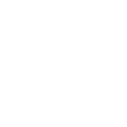

<h1 align="center">Pierre Tondereau</h1>

  

Creative software engineer, I mainly work with PHP, JavaScript since 2010 and recently Rust <3. 
Dedicated team player who enjoys working with a group and helping to develop other’s potential proficiencies. Seasoned professional with the self-righteous purpose of going beyond what is expected. 

## Languages and Technologies

  &nbsp;
  &nbsp;
  &nbsp;
  <a href="https://git-scm.com/">
    &nbsp;
  &nbsp;
  &nbsp;

## Activity

    
    

